# 日报 - 2026-03-10

## 今日目标
- 评估 `/workspace/cyclic_animation/dataset` 的 cloth 数据结构与可用性。
- 将该 dataset 接入 `extern/physical_cyclic_animations/cloth_repro` 并完成一轮实际运行。

## 今日完成
- 完成 dataset 检查：
  - 数据文件：`cloth_flag_flutter_square5K_T200_NxTx3.(npy/npz)`、`metadata`、`mp4`
  - 核心形状：`(5041, 200, 3)`，`float32`
  - `npz` key：`position_nxt3`，与 `npy` 内容一致。
- 扩展 `cloth_repro/compare_cloth_methods.py`：
  - 新增 dataset 模式（读取 `.npy/.npz`）
  - 支持轴投影 `xy/xz/yz`
  - 支持时间窗口切片与网格降采样
  - 支持 trajectory matching loss（`match_weight`）
- 编写执行说明与记录：
  - `extern/physical_cyclic_animations/cloth_repro/DATASET_RUN_2026-03-10.md`
- 完成一轮 smoke run：
  - 输出目录：`cloth_repro/outputs/dataset_smoke_20260310_seq_nogravity`
  - 已生成对比图、历史 csv、summary json。
  - 已删除旧的有重力目录：`dataset_smoke_20260310`、`dataset_smoke_20260310_seq`

## 关键产出
- 代码：`extern/physical_cyclic_animations/cloth_repro/compare_cloth_methods.py`
- 文档：`extern/physical_cyclic_animations/cloth_repro/DATASET_RUN_2026-03-10.md`
- 结果：`extern/physical_cyclic_animations/cloth_repro/outputs/dataset_smoke_20260310_seq_nogravity/*`

## Dataset 运行结果（详细）
- 输入数据：
  - `/workspace/cyclic_animation/dataset/cloth_flag_flutter_square5K_T200_NxTx3.npy`
- 本次 smoke 配置：
  - `dataset_axis=xz`
  - `dataset_start=75`
  - `dataset_len=60`
  - `dataset_downsample=3`（`71x71 -> 24x24`）
  - `steps=50`
  - `iters=60`
  - `dt=0.02`
  - `gravity=0.0`
  - `match_weight=0.2`
- 运行命令：
  - `cd /workspace/cyclic_animation/extern/physical_cyclic_animations/cloth_repro`
  - `python3 compare_cloth_methods.py --dataset /workspace/cyclic_animation/dataset/cloth_flag_flutter_square5K_T200_NxTx3.npy --dataset_axis xz --dataset_start 75 --dataset_len 60 --dataset_downsample 3 --steps 50 --iters 60 --dt 0.02 --gravity 0.0 --match_weight 0.2 --save_sequence 1 --sequence_fps 20 --sequence_stride 1 --out_dir outputs/dataset_smoke_20260310_seq_nogravity`
- 指标结果（`summary_metrics.json`）：
  - Weak:
    - `closure_pos_rmse=0.8004`
    - `closure_vel_rmse=1.3277`
    - `center_loop_closure=1.2351`
    - `trajectory_rmse=0.5863`
  - Improved:
    - `closure_pos_rmse=0.2348`
    - `closure_vel_rmse=1.0113`
    - `center_loop_closure=0.0597`
    - `trajectory_rmse=0.2571`
- 输出文件：
  - `/workspace/cyclic_animation/extern/physical_cyclic_animations/cloth_repro/outputs/dataset_smoke_20260310_seq_nogravity/summary_metrics.json`
  - `/workspace/cyclic_animation/extern/physical_cyclic_animations/cloth_repro/outputs/dataset_smoke_20260310_seq_nogravity/figure_loss_compare.png`
  - `/workspace/cyclic_animation/extern/physical_cyclic_animations/cloth_repro/outputs/dataset_smoke_20260310_seq_nogravity/figure_state_compare.png`
  - `/workspace/cyclic_animation/extern/physical_cyclic_animations/cloth_repro/outputs/dataset_smoke_20260310_seq_nogravity/figure_paper_style_panel.png`
  - `/workspace/cyclic_animation/extern/physical_cyclic_animations/cloth_repro/outputs/dataset_smoke_20260310_seq_nogravity/weak_history.csv`
  - `/workspace/cyclic_animation/extern/physical_cyclic_animations/cloth_repro/outputs/dataset_smoke_20260310_seq_nogravity/improved_history.csv`

## Dataset 可视化 Sequence（重点）
- 目标：指标不作为重点，优先输出可直接看的 cloth 动画序列。
- 运行命令：
  - `cd /workspace/cyclic_animation/extern/physical_cyclic_animations/cloth_repro`
  - `python3 compare_cloth_methods.py --dataset /workspace/cyclic_animation/dataset/cloth_flag_flutter_square5K_T200_NxTx3.npy --dataset_axis xz --dataset_start 75 --dataset_len 60 --dataset_downsample 3 --steps 50 --iters 60 --dt 0.02 --gravity 0.0 --match_weight 0.2 --save_sequence 1 --sequence_fps 20 --sequence_stride 1 --out_dir outputs/dataset_smoke_20260310_seq_nogravity`
- Sequence 输出目录：
  - `/workspace/cyclic_animation/extern/physical_cyclic_animations/cloth_repro/outputs/dataset_smoke_20260310_seq_nogravity`
- 关键文件（均为 51 帧）：
  - `/workspace/cyclic_animation/extern/physical_cyclic_animations/cloth_repro/outputs/dataset_smoke_20260310_seq_nogravity/sequence_target.gif`（`640x480`）
  - `/workspace/cyclic_animation/extern/physical_cyclic_animations/cloth_repro/outputs/dataset_smoke_20260310_seq_nogravity/sequence_weak.gif`（`640x480`）
  - `/workspace/cyclic_animation/extern/physical_cyclic_animations/cloth_repro/outputs/dataset_smoke_20260310_seq_nogravity/sequence_improved.gif`（`640x480`）
  - `/workspace/cyclic_animation/extern/physical_cyclic_animations/cloth_repro/outputs/dataset_smoke_20260310_seq_nogravity/sequence_triplet.gif`（`1456x420`，左=target，中=weak，右=improved）
- 备注：
  - `compare_cloth_methods.py` 已支持 `--save_sequence/--sequence_fps/--sequence_stride`，后续可以直接批量导出不同窗口的 GIF。

## Sequence 抽帧预览（10 帧）
- 说明：以下图片来自 **无重力** 结果 `dataset_smoke_20260310_seq_nogravity/sequence_triplet.gif`，每帧均为三联图（左=target，中=weak，右=improved）。

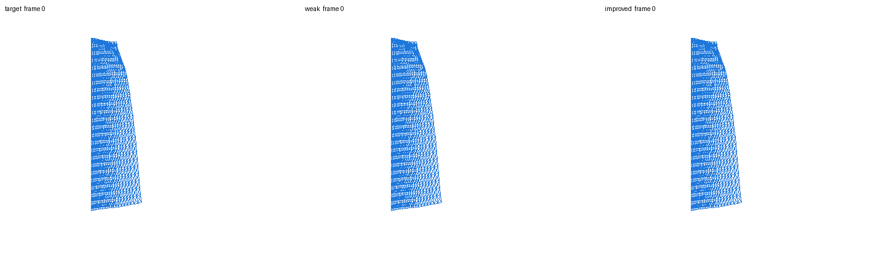
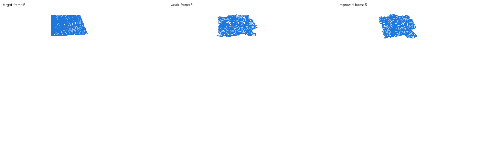
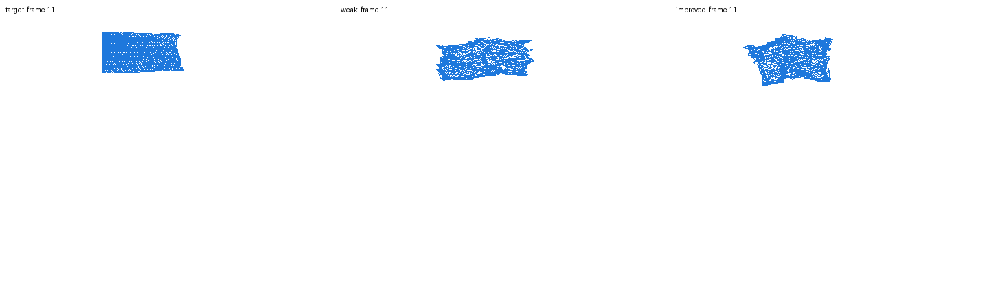
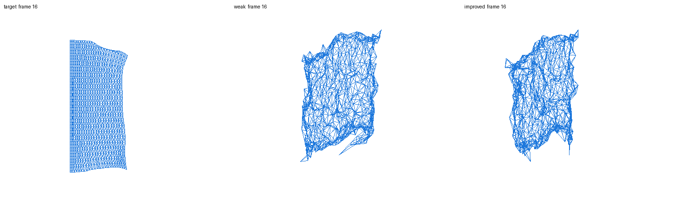
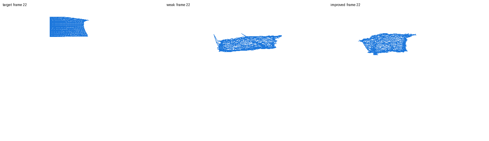
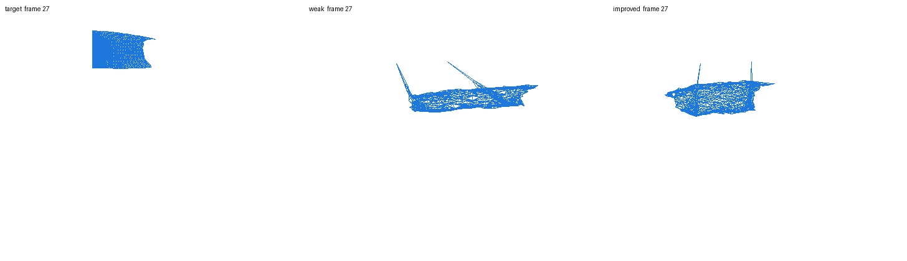
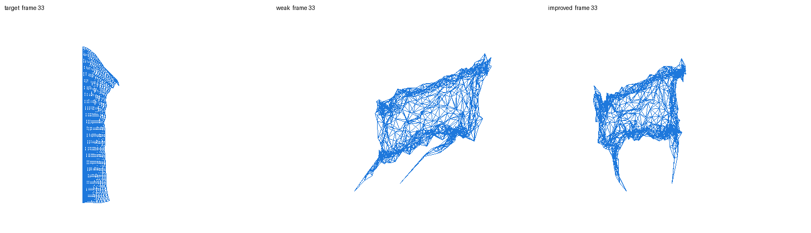
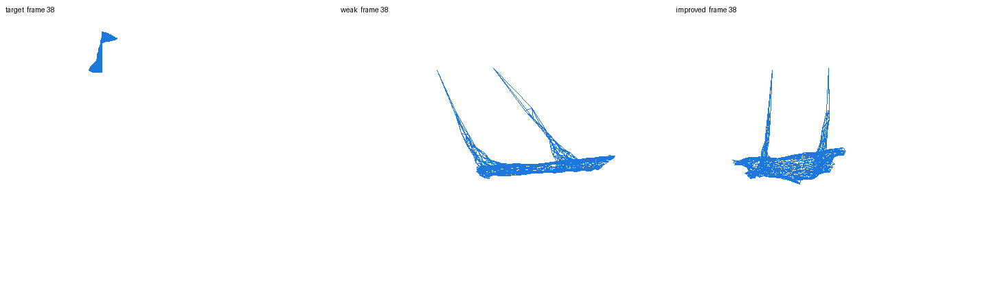
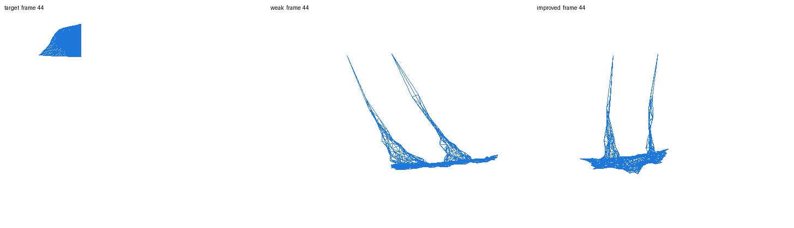
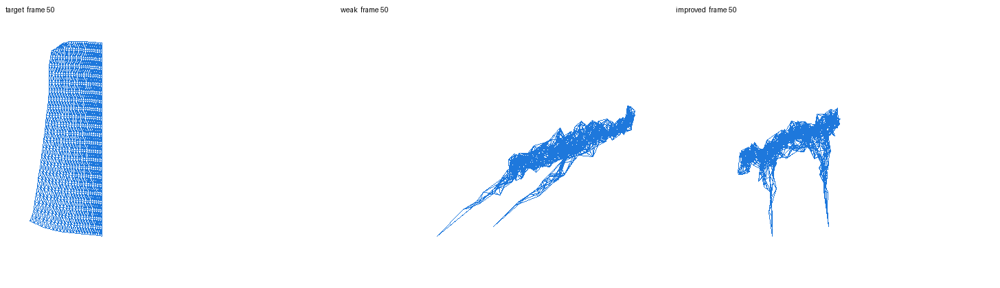

## DMD V1 方案（全分辨率 ROM）
- 核心原则：
  - 不做下采样，直接使用 `5K` 顶点（`N=5041`）建模。
  - 把 DMD 当作 ROM（Reduced-Order Model），降阶发生在状态空间（如 PCA/模态空间），不是在网格点上删点。
- 数据与状态：
  - 输入：`/workspace/cyclic_animation/dataset/cloth_flag_flutter_square5K_T200_NxTx3.npy`
  - 时间步：`dt=0.02`
  - 状态：`s_t=[p_t, v_t]`，其中 `v_t=(p_t-p_{t-1})/dt`
  - 约束：无重力（`gravity=0.0`），保持与当前观测一致。
- 模型流程：
  - Step 1：全分辨率构建快照矩阵（不降采样）。
  - Step 2：对状态做 ROM 降阶（PCA/SVD 保留主要能量）。
  - Step 3：在 ROM 空间拟合 Delay-DMD（优先，窗口先试 `w=20`）。
  - Step 4：对主模态做谱稳定约束（`|lambda|` 约束接近 1）后 rollout。
  - Step 5：反变换回全分辨率顶点，得到 `T,N,3` 的 `position` 与 `velocity`。
- 产物约定：
  - 导出 `npz`，key 为 `position`、`velocity`、`feats`。
  - `position/velocity` 形状：`T,N,3`（`N=5041`）。
  - `feats` 形状：`N,D`（至少包含质量或边界标记等静态点特征）。
  - 同步输出 `target/dmd/triplet` 可视化序列。
- 验证标准（V1）：
  - 以可视化序列为主；
  - 指标只保留 `trajectory_rmse`、`center_loop_closure`、长时漂移（如 100 帧）。

## DMD V1 实跑结果（全分辨率 5K）
- 执行脚本：
  - `/workspace/cyclic_animation/extern/physical_cyclic_animations/cloth_repro/run_dmd_rom_cloth.py`
- 运行命令：
  - `cd /workspace/cyclic_animation/extern/physical_cyclic_animations/cloth_repro`
  - `python3 run_dmd_rom_cloth.py --dataset /workspace/cyclic_animation/dataset/cloth_flag_flutter_square5K_T200_NxTx3.npy --dt 0.02 --pca_rank 64 --delay 20 --dmd_rank 120 --rollout_frames 100 --period 0 --radius_eps 0.0 --axis xz --save_sequence 1 --gif_fps 20 --gif_stride 1 --out_dir outputs/dmd_rom_v1_fullres_20260310`
- 输出目录：
  - `/workspace/cyclic_animation/extern/physical_cyclic_animations/cloth_repro/outputs/dmd_rom_v1_fullres_20260310`
- 数据集产物（符合约定 key）：
  - `dmd_rom_dataset.npz`，key=`position/velocity/feats`
  - `position` 形状：`(100, 5041, 3)`
  - `velocity` 形状：`(100, 5041, 3)`
  - `feats` 形状：`(5041, 5)`
- 可视化序列：
  - `sequence_target.gif`
  - `sequence_dmd.gif`
  - `sequence_triplet.gif`
- 可视化内嵌（仓库可直接渲染）：
  - `reports/daily/assets/2026-03-10/dmd_v1_sequence_target.gif`
  - `reports/daily/assets/2026-03-10/dmd_v1_sequence_dmd.gif`
  - `reports/daily/assets/2026-03-10/dmd_v1_sequence_triplet.gif`

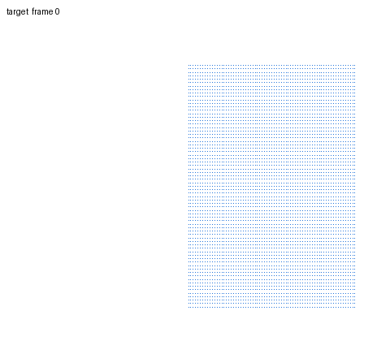
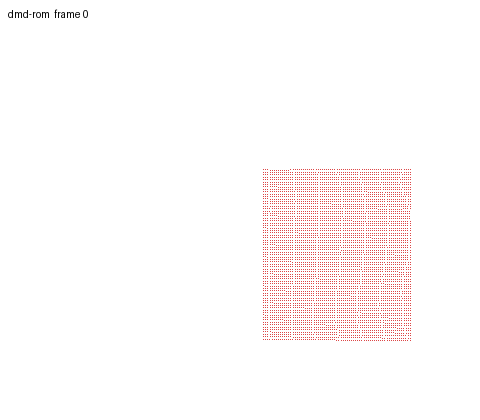
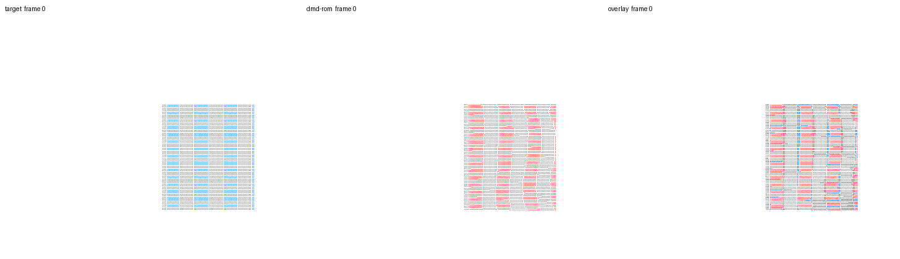

- 关键结果（`summary.json`）：
  - `period_used=100`（自动估计）
  - `trajectory_rmse=0.1778`
  - `velocity_rmse=0.8663`
  - `center_loop_closure=0.2564`
  - 谱投影后 `abs_lambda_mean_after=1.0`（周期约束生效）

## 当前状态
- dataset 已可直接驱动 cloth_repro 跑 weak vs improved。
- 当前无重力 smoke 配置下 improved 相对 weak 提升明显，序列观感稳定很多。
- 关键提升（smoke）：
  - `trajectory_rmse`: `0.5863 -> 0.2571`（约 56.2%）
  - `center_loop_closure`: `1.2351 -> 0.0597`（约 95.2%）

## 下一步计划
1. 以 `dataset_start`、`match_weight`、`k_struct/k_shear/damping` 为主轴做小规模网格搜索。
2. DMD 路线固定全分辨率 `N=5041`，不做网格下采样，仅在 ROM 空间做降阶与稳定化。
3. 评估是否需要加入更强约束（如刚体漂移项）进一步稳定闭环。
